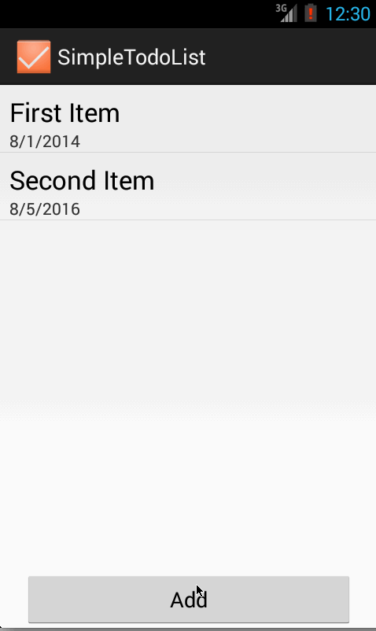

This is an Android Demo Project made for the Android Bootcamp. Its simple Todo list application where you can add, delete and edit items. 

App features:

    * Add an item by typing in the text box and pressing Add. 
    * Remove an item by long pressing any item
    * Edit an item by clicking on it. 

Extensions:

    - Use a DialogFragment instead of new Activity for editing items
    - Persist the todo app in SQLite instead of using a text file
    - Add support for completion due dates for items

Walkthrough for the feature:

Original

With DialogFragment

With DueDate

GIF created with [LiceCap](http://www.cockos.com/licecap/).
